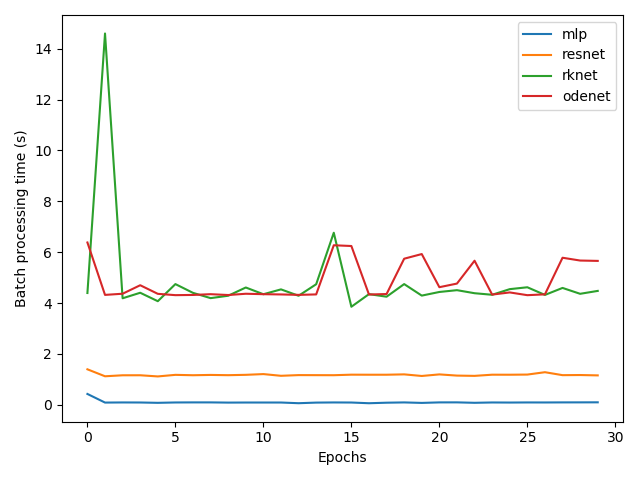
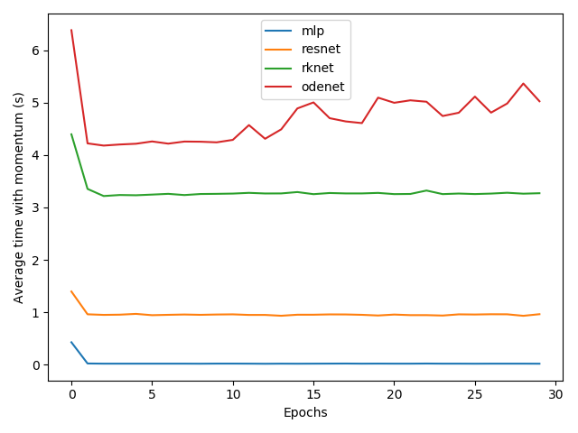

# pytorch-mnist

Replicating the experiment presented in the paper 
[Neural ODE](https://arxiv.org/pdf/1806.07366.pdf). 

Implementing models MLP with 1 hidden layer, ResNet, RK-Net (Runge Kutta Net) 
and ODE-Net using framework PyTorch and comparing 
their performance on [MNIST](http://yann.lecun.com/exdb/mnist/).
Also used [torchdiffeq](https://github.com/rtqichen/torchdiffeq) 
library provided by authors of the paper.

Model architectures and process of training are saved in
log files in [logs](/logs) directory. Models were given 30 epochs on training.
Batch size is 128, learning rate - 0.01. 

### Performance

The observed performance is similar to the one presented by authors of the paper.

| |Test error | Parameters |
| --- | :---: | :---: |
| 1-layer MLP | 4.59% | 0.20 M
| ResNet | 0.40% | 0.58 M
| RK-Net | 0.64% | 0.21 M
| ODENet | 0.57% | 0.21 M

### Training time comparison

All models were training on a CPU.

| | |
:---:|:---:
|||
| Batch processing time | Average time with momentum |